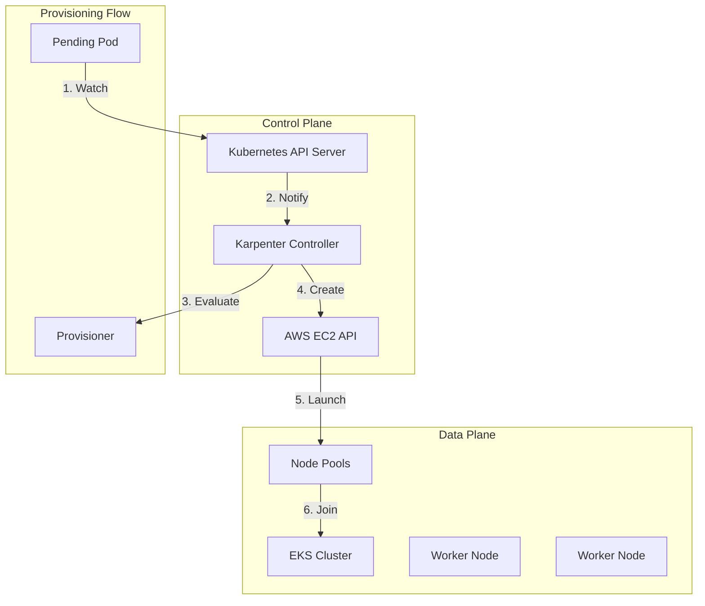

# EKS + Karpenter

## TOC


- [Architecture Overview](#architecture-overview)
- [Repository Structure](#repository-structure)
- [IaC Setup](#iac-setup)
- [EKS Cluster Configuration](#eks-cluster-configuration)
- [Node Pool Strategies](#node-pool-strategies)
- [Java Application Configuration](#java-application-configuration)
- [Observability and Monitoring](#observability-and-monitoring)
- [Security and Compliance](#security-and-compliance)
- [Disaster Recovery](#disaster-recovery)
- [Cost Optimization](#cost-optimization)
- [Operational Runbooks](#operational-runbooks)

## Architecture Overview

Karpenter is a K8 native autosacaler that provisions right-sized nodes in response to pending pods. Unlike traditional Autoscaler, Karpenter makes instantaneous scheduling decisions based on aggregate resource requests.



**Key Components**:
- **Karpenter Controller**: Makes provisioning decisions.
- **Provisioner CRD**: Defines node constraints and scheduling.
- **AWSNodeTemplate**: Defines EC2 configuration.
- **Interruption Handling**: Gracefully handles spot interruptions.

## Repository Structure

```
karpenter-eks-platform/
├── infrastructure/
│   ├── terraform/
│   │   ├── modules/
│   │   │   ├── vpc/
│   │   │   ├── eks/
│   │   │   ├── karpenter/
│   │   │   └── networking/
│   │   ├── environments/
│   │   │   ├── dev/
│   │   │   ├── staging/
│   │   │   └── prod/
│   │   └── main.tf
│   └── helm/
│       ├── karpenter/
│       ├── monitoring/
│       └── app-charts/
├── applications/
│   ├── base/
│   │   ├── kustomization.yaml
│   │   ├── namespace.yaml
│   │   └── rbac.yaml
│   └── overlays/
│       ├── dev/
│       └── prod/
├── gitops/
│   ├── argocd/
│   ├── flux/
│   └── kustomize/
├── config/
│   ├── karpenter/
│   │   ├── provisioners/
│   │   └── nodetemplates/
│   └── monitoring/
├── scripts/
│   ├── bin/
│   └── utils/
└── README.md
```

## IaC Setup

The below snippet defines the AWS IAM resource to enable Karpenter to function correctly. The core mechanism is the IRSA, which allows Service Accounts to assume an IAM role, granting permissions for Karpenter controller pod without needing long-lived AWS credentials.

```t
# modules/karpenter/main.tf
# This module block creates an IAM role that Karpenter Controller will use to interact with
# AWS API (IRSA) using publicly maintained module
module "karpenter_irsa" {
    source = "terraform-aws-modules/iam/aws//modules/iam-role-for-service-accounts-eks"
    version = "~> 5.20"

    role_name = "karpenter-controller-${var.cluster_name}"

    # Configure the trust relationship for the IAM role, only specified K8 Service Accounts
    oidc_providers = {
        main = {
            # The ARN of the OpenID Connect provider for this EKS cluster
            provider_arn               = module.eks.oidc_provider_arn
            namespace_service_accounts = ["karpenter:karpenter"]
        }
    }

    # Attach a custom policy (below) to this IAM role
    role_policy_arns = {
        policy = aws_iam_policy.karpenter_controller.arn
    }
}

# Defines the actual permissions policy that Karpenter controller needs
resource "aws_iam_policy" "karpenter_controller" {
    name        = "KarpenterController-${var.cluster_name}"
    description = "IAM policy for Karpenter controller"

    policy = jsonencode({
        Version = "2012-10-17"
        Statement = [
            {
                # Statement 1: Permissions to Describe, Launch, Tag resources
                Effect = "Allow"
                Action = [
                  "ec2:DescribeImages",
                  "ec2:RunInstances",
                  "ec2:DescribeSubnets",
                  "ec2:DescribeSecurityGroups",
                  "ec2:DescribeLaunchTemplates",
                  "ec2:DescribeInstances",
                  "ec2:DescribeInstanceTypes",
                  "ec2:DescribeInstanceTypeOfferings",
                  "ec2:DescribeAvailabilityZones",
                  "ec2:DeleteLaunchTemplate",
                  "ec2:CreateTags",
                  "ec2:CreateLaunchTemplate",
                  "ec2:CreateFleet",
                  "ec2:DescribeSpotPriceHistory",
                  "pricing:GetProducts",
                  "ssm:GetParameter"
                ] # Applies to all resources for these read and creation operations
                Resource = "*"
            },
            {
                # Statement 2: Permissions to Terminate Instances (Autoscaling Down)
                Effect = "Allow"
                Action = "ec2:TerminateInstances"
                Condition = {
                    # Critical! Ensures Karpenter can only terminate nodes that it/the cluster owns, preventing accidental deletion
                    StringLike = {
                        # Node must be tagged as owned by EKS cluster AND tagged as provisioned by Karpenter Provisioner
                        "ec2:ResourceTag/kubernetes.io/cluster/${var.cluster_name}" = "owned"
                        "ec2:ResourceTag/karpenter.sh/provisioner-name" = "*"
                    }
                }
                Resource = "*"
            },
            {
                # Statement 3: Permission to pass the node role to EC2 instance
                Effect = "Allow"
                Action = "iam:PassRole"
                Resource = var.node_iam_role_arn
                # Required so Karpenter can launch new EC2 instances with the correct IAM instance profile
                # which is associated with the nodes IAM role
            }
        ]
    })
}

# Instance profile for nodes
# Container for the IAM role that gets attached to actual EC2 node instances
# While the Karpenter controller uses the karpenter_irsa role, the nodes it launches use this role
resource = "aws_iam_instance_profile" "karpenter" {
    # Attaches the pre-existing IAM role for EKS nodes (defined elsewhere, passed in via variable)
    # to this Instance profile. The new EC2 instances launched by Karpenter will use this profile
    name = "KarpenterNodeInstanceProfile-${var.cluster_name}"
    role = var.node_iam_role_name
    # This aws_iam_role would be an EKSWorkerNodeRole-mycluster, with a policy allowing EC2 instances to assume the role
}
```

## EKS Cluster Configuration

```t
# modules/eks/main.tf
module "eks" {
  source  = "terraform-aws-modules/eks/aws"
  version = "~> 19.0"

  cluster_name    = var.cluster_name
  cluster_version = "1.28"

  vpc_id     = var.vpc_id
  subnet_ids = var.private_subnets

  # Managed Node Group is the base/default group
  # Kept small to host core services like coredns, metrics server, etc
  eks_managed_node_groups = {
    initial = {
      instance_types = ["t3.medium"] # Small, Non-prod for low-resource control plane components
      
      min_size     = 1
      max_size     = 3
      desired_size = 2
      
      # Required for Karpenter, attaches SSM policy to EKS Node IAM role for maintenance, troubleshooting and
      # required by Karpenter to register with SSM for instance metadata lookups
      iam_role_additional_policies = {
        AmazonSSMManagedInstanceCore = "arn:aws:iam::aws:policy/AmazonSSMManagedInstanceCore"
      }
    }
  }

  # Add tags for Karpenter, to discover cluster subnets SGs, and other resources needed for launching newnodes
  tags = {
    "karpenter.sh/discovery" = var.cluster_name
  }
}

# Output for Karpenter, Crucial for exposing details needed by separate Karpenter module to configure IRSA
# The URL for the EKS API server. Used by the Karpenter controller to interact with the cluster.
output "cluster_endpoint" {
  value = module.eks.cluster_endpoint
}

# The CA certificate data required for the Karpenter controller to securely verify
output "cluster_certificate_authority_data" {
  value = module.eks.cluster_certificate_authority_data
}

# CRITICAL FOR IRSA: The ARN of the OpenID Connect (OIDC) provider created by EKS.
# ensuring only the Kubernetes Service Account can assume the AWS permissions
output "oidc_provider_arn" {
  value = module.eks.oidc_provider_arn
}
```

**Considerations**:
- Make sure subnets are tagged so that Karpenter can use them `kubernetes.io/cluster/cluster: owned`, `karpenter.sh/discovery: cluster`
- Ensure the CI/CD environment uses the `kubeconfig` generated by this module (i.e. a separate output or `local-exec` block)

### Helm Configuration

```yaml
# helm/karpenter/values.yaml
# Settings passed directly to the Karpenter controller.
settings:
  clusterName: ${EKS_CLUSTER_NAME}    
  clusterEndpoint: ${EKS_CLUSTER_ENDPOINT} # Required: The API server endpoint for the EKS cluster.
  # CRITICAL: This is the SQS queue name for AWS services like EC2 Auto Scaling, Health Dashboard, EventBridge to send notifications 
  # about instance termination, allowing Karpenter to gracefully drain nodes.
  interruptionQueueName: ${INTERRUPTION_QUEUE} 

serviceAccount:
  annotations:
    # CRITICAL for IRSA: This annotation links the Service Account to the AWS IAM Role
    # that holds the necessary permissions (ec2:RunInstances, ec2:TerminateInstances, etc.).
    eks.amazonaws.com/role-arn: ${KARPENTER_IAM_ROLE_ARN}

# Specifies the number of Karpenter controller pods to run.
replicas: 2   # Good: Running 2 replicas provides HA in case one fails

# Resource limits and requests for the Karpenter controller pods.
resources:
  requests:
    memory: "256Mi"
    cpu: "250m"   # Good: Setting requests ensures the scheduler reserves capacity.
  limits:
    memory: "512Mi"
    cpu: "500m"   # Good: Setting limits prevents the controller from consuming all node resources.

# Scheduling preference to keep controller pods on separate nodes using antiaffinity
# Do not place a new pod on a host that hosts that specified group (karpenter label)
affinity:
  podAntiAffinity:
    # scheduler will try its BEST to satisfy this rule, its a soft requirement (100 means the strongest)
    preferredDuringSchedulingIgnoredDuringExecution:
    - weight: 100
      podAffinityTerm:
        labelSelector:
          matchExpressions:
          - key: app.kubernetes.io/name
            operator: In
            values:
            - karpenter
        topologyKey: kubernetes.io/hostname
  # Good: This setting ensures that the two `replicas` are preferentially scheduled onto different nodes
```

```bash
#!/bin/bash
# scripts/bin/install-karpenter.sh

export KARPENTER_VERSION="v0.32.0"
export CLUSTER_NAME="my-cluster"
export CLUSTER_ENDPOINT="$(aws eks describe-cluster --name "${CLUSTER_NAME}" --query "cluster.endpoint" --output text)"

# NOTE: KARPENTER_IAM_ROLE_ARN and INTERRUPT_QUEUE_NAME must be set in env or fetched from elsewhere
export KARPENTER_IAM_ROLE_ARN="arn:aws:iam::123456789012:role/karpenter-controller-my-cluster"
export INTERRUPTION_QUEUE="karpenter-sqs-queue" 

VALUES_FILE="./helm/karpenter/values.yaml" 

helm upgrade --install karpenter oci://public.ecr.aws/karpenter/karpenter \
  --version "${KARPENTER_VERSION}" \
  --namespace karpenter \
  --create-namespace \
  --wait \
  \
  # Use the --values flag to load the base configuration (replicas, resources, affinity)
  --values "${VALUES_FILE}" \
  \
  # Use --set to override the dynamic variables defined in the shell script.
  --set serviceAccount.annotations."eks\.amazonaws\.com/role-arn"="${KARPENTER_IAM_ROLE_ARN}" \
  --set settings.clusterName="${CLUSTER_NAME}" \
  --set settings.clusterEndpoint="${CLUSTER_ENDPOINT}" \
  --set settings.interruptionQueueName="${INTERRUPTION_QUEUE}" \
  --set settings.defaultInstanceProfile="KarpenterNodeInstanceProfile-${CLUSTER_NAME}"
```

**Considerations**:
- Add a **PDB** (defined in the Helm chart) to ensure that voluntary disruptions like node upgrades keep at least one replica.
- `preferredDuringSchedulingIgnoredDuringExecution` is a soft requirement, the scheduler will try to satisfy this rule during the initial scheduling process. If separation is broken after scheduling, a node is tainted/removed, the pods will not be evicted
- When running `helm upgrade --install` using `--set` flag, Helm will override the values from `--values` file, for each entry.

## Node Pool Strategies

### Multi Strategy Provisioner Configuration

```yaml
# config/karpenter/provisioners/general-purpose.yaml
apiVersion: karpenter.sh/v1alpha5
kind: Provisioner
metadata:
  name: general-purpose
spec:
  # Requirements constrain the parameters of provisioned nodes.
  requirements:
    - key: karpenter.sh/capacity-type
      operator: In
      values: ["spot", "on-demand"]
    - key: kubernetes.io/arch
      operator: In
      values: ["amd64", "arm64"]
    - key: karpenter.k8s.aws/instance-category
      operator: In
      values: ["c", "m", "r"]
    - key: karpenter.k8s.aws/instance-generation
      operator: Gt
      values: ["2"]

  # Resource limits constrain the total size of the cluster.
  limits:
    resources:
      cpu: 1000  # Cluster size will not exceed 1000 vCPUs across all nodes managed by this provisioner
      memory: 1000Gi # Cluster memory will not exceed 1000 GiB

  # Labels are applied to every node.
  labels:
    environment: production
    managed-by: karpenter

  # Taints are applied to every node. Only pods with this matching toleration can be scheduled
  taints:
    - key: dedicated
      value: workload
      effect: NoSchedule

  # Startup taints are taints that are temporarily applied to nodes during startup.
  startupTaints:
    - key: node.kubernetes.io/not-ready
      effect: NoSchedule

  # ProviderRef references the AWSNodeTemplate resource
  providerRef:
    name: default

  # Consolidation Policy: Cost Optimization by terminating underutilized nodes after pod shuffling
  consolidation:
    enabled: true
---
apiVersion: karpenter.k8s.aws/v1alpha1
kind: AWSNodeTemplate
metadata:
  name: default
spec:
  subnetSelector: # This tag should be applied to all EKS cluster subnets and security groups
    karpenter.sh/discovery: ${CLUSTER_NAME}
  securityGroupSelector:
    karpenter.sh/discovery: ${CLUSTER_NAME}
  
  # Instance Profile: New EC2 nodes will assume granting necessary permissions
  instanceProfile: KarpenterNodeInstanceProfile-${CLUSTER_NAME}
  
  # Block Device Mappings
  blockDeviceMappings:
    - deviceName: /dev/xvda
      ebs:
        volumeSize: 100Gi # Root volume size
        volumeType: gp3 # cost-effective and high-performance gp3 volume type
        encrypted: true
        deleteOnTermination: true
  
  # Enables CloudWatch detailed monitoring (1-minute intervals) for better visibility
  detailedMonitoring: true
  
  # Metadata Options
  metadataOptions:
    httpEndpoint: enabled
    httpProtocolIPv6: disabled
    httpPutResponseHopLimit: 2
    httpTokens: required # Ensures IMDSv2 is strictly enforced for security
  
  # Tags applied to every instance, for compliance, billing, etc
  tags:
    CostCenter: "Platform"
    BusinessUnit: "Engineering"
    Compliance: "PCI-DSS"
```

**Considerations**:
- `Provisioner`: Defines *what kind of node is needed* based on K8 requirements and cluster limits.
- `AWSNodeTemplate`: Defines how Karpenter *interacts with AWS* to launch that node (networking, storage, metadata).
- **IMDSv2**: Requiring `httpTokens` forces use of Instance Metadata Service Version 2, which is AWS best practice against SSRF attacks.

### Specialized Provisioners

```yaml
# config/karpenter/provisioners/gpu-workloads.yaml
apiVersion: karpenter.sh/v1alpha5
kind: Provisioner
metadata:
  name: gpu-accelerated
spec:
  requirements:
    - key: node.kubernetes.io/instance-type
      operator: In
      values:
        - g5.* # Includes NVIDIA A10G-based GPU instances (modern, popular)
        - p4.* # Includes NVIDIA A100-based instances (highest perf/cost)
        - p3.* # Older V100 NVIDIA instances, (legacy, high cost)
    - key: karpenter.k8s.aws/instance-gpu-count
      operator: Exists
    - key: karpenter.k8s.aws/instance-gpu-manufacturer
      operator: In
      values: ["nvidia"]
    - key: karpenter.sh/capacity-type
      operator: In
      values: ["on-demand"]
      # CRITICAL: GPU workloads are generally expensive, long-running, and cannot tolerate Spot interruption

  ttlSecondsAfterEmpty: 300 # Terminate node 5 minutes after last pod leaves
  ttlSecondsUntilExpired: 604800  # 7 days to terminate nodes to force refresh/patching of AMI updates

  # Labels for prometheus scraping, billing, workload selection
  labels:
    accelerator: nvidia-gpu
    workload-type: ai-ml

  # References corresponding AWSNodeTemplate
  providerRef:
    name: gpu-nodes
---
# config/karpenter/provisioners/batch-jobs.yaml
apiVersion: karpenter.sh/v1alpha5
kind: Provisioner
metadata:
  name: batch-processing
spec:
  requirements:
    - key: karpenter.sh/capacity-type
      operator: In
      values: ["spot"] # Forces provisioner to use SPOT instances
    - key: kubernetes.io/arch
      operator: In
      values: ["amd64"] # Restricts to AMD architecture (Graviton/arm64 often excluded if batch jobs require specific libraries)
    - key: karpenter.k8s.aws/instance-category
      operator: In
      values: ["c", "m"] # Limited to standard Compute or general-purpose

  # Allow larger instances for batch workloads
  limits:
    resources:
      cpu: 2000
      memory: 4000Gi

  # If multiple provisioners will work for a Pending pod, the one with the HIGHEST weight is chosen.
  weight: 50  # Implicit default is 100 which is the max

  ttlSecondsAfterEmpty: 45 # Terminate node 45 seconds after last pod leaves

  labels:
    workload-type: batch
    scheduling: interruptible # Clear tag indicating this node can be terminated anytime (Spot).

  # Prevents any Pod from running here UNLESS it explicitly tolerates the 'spot=true' taint, enforcing isolation for batch jobs.
  taints:
    - key: spot
      value: "true"
      effect: NoSchedule
```

**Considerations**:
- `weight: 50` implies that if a pod can run on either Provisioner or the default general-purpose, the default will be chosen first, keeping the batch workloads separate.
- **Isolation Enforcement**: `spot=true:NoSchedule` means a pod MUST have a matching toleration (`tolerations: [{key: "spot", value: "true", effect: "NoSchedule"}]`).
- **Best Practice**: defining an `AWSNodeTemplate` for each provisioner, even if reused, to define consistent SGs, instance profiles, and EBS volume size/type for batch jobs.

## Java Application Configuration

## Observability and Monitoring

- Config/monitoring/karpenter-rules.yaml

```yaml
apiVersion: monitoring.coreos.com/v1
kind: PrometheusRule
metadata:
  name: karpenter-metrics
  namespace: monitoring
spec:
  groups:
  - name: karpenter
    rules:
    - alert: KarpenterNodeProvisioningFailing
    # rate(karpenter_nodes_created_total[5m]) == 0 - this is the symptom condition
    # kube_pod_status_phase{phase="Pending"} > 0 - This is the cause/magnitude condition
      expr: |
        rate(karpenter_nodes_created_total[5m]) == 0
        and
        kube_pod_status_phase{phase="Pending"} > 0
      for: 5m
      labels:
        severity: critical
      annotations:
        summary: "Karpenter is not provisioning nodes despite pending pods"
        # $value is the result of the entire expression will be count of pending pods (single value since and used)
        description: "No nodes created in last 5 minutes while {{ $value }} pods are pending"
    
    - alert: HighNodeReplacementRate
      expr: |
        rate(karpenter_nodes_terminated_total[1h]) > 10
      for: 15m
      labels:
        severity: warning
      annotations:
        summary: "High node termination rate detected"
        description: "Node termination rate is {{ $value }} per hour"
    
    - alert: SpotInterruptionWarning
      expr: |
        karpenter_interruption_actions_performed_total{action="terminate"} > 0
      for: 0m
      labels:
        severity: warning
      annotations:
        summary: "Spot interruption detected"
        description: "AWS is terminating {{ $value }} spot instances"
    
    - alert: ProvisionerResourceLimitExceeded
      expr: |
        karpenter_limit_resources{resource="cpu"} - karpenter_allocatable_resources{resource="cpu"} < 0
      for: 5m
      labels:
        severity: warning
      annotations:
        summary: "Provisioner resource limit exceeded"
        description: "CPU limit exceeded by {{ $value }} cores"
```

- Grafana Dashboard

```json
{
  "dashboard": {
    "title": "Karpenter EKS Overview",
    "panels": [
      {
        "title": "Node Provisioning Rate",
        "targets": [{
          "expr": "rate(karpenter_nodes_created_total[5m])",
          "legendFormat": "{{provisioner}}"
        }]
      },
      {
        "title": "Pending Pods vs Available Capacity",
        "targets": [
          {
            "expr": "sum(kube_pod_status_phase{phase='Pending'})",
            "legendFormat": "Pending Pods"
          },
          {
            "expr": "sum(karpenter_allocatable_resources{resource='cpu'})",
            "legendFormat": "Available CPU"
          }
        ]
      },
      {
        "title": "Instance Type Distribution",
        "targets": [{
          "expr": "sum by (instance_type) (karpenter_nodes_allocatable{resource='cpu'})",
          "legendFormat": "{{instance_type}}"
        }]
      },
      {
        "title": "Cost Breakdown by Capacity Type",
        "targets": [{
          "expr": "sum by (capacity_type) (karpenter_nodes_allocatable{resource='cpu'} * ondemand_hourly_rate)",
          "legendFormat": "{{capacity_type}}"
        }]
      }
    ]
  }
}
```

- CloudWatch Configuration:

```h
# terraform/cloudwatch-logs.tf
resource "aws_cloudwatch_log_group" "karpenter" {
  name              = "/aws/eks/${var.cluster_name}/karpenter"
  retention_in_days = 30
  
  tags = {
    Application = "Karpenter"
    Environment = var.environment
  }
}

resource "aws_cloudwatch_metric_alarm" "high_error_rate" {
  alarm_name          = "karpenter-high-error-rate-${var.cluster_name}"
  comparison_operator = "GreaterThanThreshold"
  evaluation_periods  = "2"
  metric_name        = "ErrorCount"
  namespace          = "Karpenter"
  period             = "300"
  statistic          = "Sum"
  threshold          = "10"
  alarm_description  = "High error rate in Karpenter controller"
  alarm_actions      = [aws_sns_topic.alerts.arn]
  
  dimensions = {
    ClusterName = var.cluster_name
  }
}
```

## Security and Compliance

- Pod Security Policy and Kyverno (Cloud Native Security) Cluster Policy

```yaml
# config/security/psp-replacement.yaml
apiVersion: policy/v1beta1
kind: PodSecurityPolicy
metadata:
  name: karpenter-restricted
spec:
  privileged: false
  allowPrivilegeEscalation: false
  requiredDropCapabilities:
    - ALL
  volumes:
    - 'configMap'
    - 'emptyDir'
    - 'projected'
    - 'secret'
    - 'downwardAPI'
    - 'persistentVolumeClaim'
  hostNetwork: false
  hostIPC: false
  hostPID: false
  runAsUser:
    rule: 'MustRunAsNonRoot'
  seLinux:
    rule: 'RunAsAny'
  supplementalGroups:
    rule: 'MustRunAs'
    ranges:
      - min: 1
        max: 65535
  fsGroup:
    rule: 'MustRunAs'
    ranges:
      - min: 1
        max: 65535
  readOnlyRootFilesystem: true
---
# Kyverno Policies for Karpenter
apiVersion: kyverno.io/v1
kind: ClusterPolicy
metadata:
  name: require-resource-requests
spec:
  validationFailureAction: enforce
  background: true
  rules:
  - name: validate-resource-requests
    match:
      resources:
        kinds:
        - Pod
    validate:
      message: "CPU and memory requests are required"
      pattern:
        spec:
          containers:
          - resources:
              requests:
                memory: "?*"
                cpu: "?*"
```

- Network Policy

```yaml
# config/security/network-policies.yaml
apiVersion: networking.k8s.io/v1
kind: NetworkPolicy
metadata:
  name: karpenter-control-plane
  namespace: karpenter
spec:
  podSelector:
    matchLabels:
      app.kubernetes.io/name: karpenter
  policyTypes:
  - Ingress
  - Egress
  ingress:
  - from:
    - namespaceSelector:
        matchLabels:
          kubernetes.io/metadata.name: kube-system
    ports:
    - protocol: TCP
      port: 8443
    - protocol: TCP
      port: 10250
  egress:
  - to:
    - ipBlock:
        cidr: 169.254.169.254/32
    ports:
    - protocol: TCP
      port: 80
    - protocol: TCP
      port: 443
  - to:
    - ipBlock:
        cidr: 0.0.0.0/0
    ports:
    - protocol: TCP
      port: 443
    - protocol: TCP
      port: 10250
```

### AWS Security Configuration

```h
# terraform/security.tf
resource "aws_kms_key" "ebs_kms" {
  description             = "KMS key for EBS encryption"
  deletion_window_in_days = 30
  enable_key_rotation    = true
  
  policy = jsonencode({
    Version = "2012-10-17"
    Statement = [
      {
        Sid    = "Enable IAM User Permissions"
        Effect = "Allow"
        Principal = {
          AWS = "arn:aws:iam::${data.aws_caller_identity.current.account_id}:root"
        }
        Action   = "kms:*"
        Resource = "*"
      },
      {
        Sid    = "Allow service-linked role for EC2"
        Effect = "Allow"
        Principal = {
          AWS = "arn:aws:iam::${data.aws_caller_identity.current.account_id}:role/aws-service-role/autoscaling.amazonaws.com/AWSServiceRoleForAutoScaling"
        }
        Action = [
          "kms:Encrypt",
          "kms:Decrypt",
          "kms:ReEncrypt*",
          "kms:GenerateDataKey*",
          "kms:DescribeKey"
        ]
        Resource = "*"
      }
    ]
  })
}

resource "aws_security_group" "karpenter_nodes" {
  name        = "karpenter-nodes-${var.cluster_name}"
  description = "Security group for Karpenter nodes"
  vpc_id      = var.vpc_id
  
  ingress {
    description     = "Cluster API server"
    from_port       = 443
    to_port         = 443
    protocol        = "tcp"
    security_groups = [module.eks.cluster_security_group_id]
  }
  
  ingress {
    description     = "Node to node communication"
    from_port       = 0
    to_port         = 0
    protocol        = "-1"
    self            = true
  }
  
  egress {
    from_port   = 0
    to_port     = 0
    protocol    = "-1"
    cidr_blocks = ["0.0.0.0/0"]
  }
  
  tags = {
    "karpenter.sh/discovery" = var.cluster_name
  }
}
```

## Disaster Recovery

### Recovery Targets

**RTO/RPO Targets**

| Component| RTO| RPO| Strategy| 
|------- |----- |--------- | -----|
| EKS Control Plane| 5min| 0| AWS-managed HA| 
| Karpenter Nodes| 10min| 0| Auto-provisioning| 
| Stateless Apps| 15min| 0| GitOps redeploy| 
| Stateful Apps| 60min| 1hr| Velero + EBS snapshots| 
| Cross-Region| 4hr| 1hr| Warm standby| 

### Multi-AZ and Multi-Region Strategy

```yaml
# config/karpenter/provisioners/multi-az.yaml
apiVersion: karpenter.sh/v1alpha5
kind: Provisioner
metadata:
  name: multi-az
spec:
  requirements:
    - key: topology.kubernetes.io/zone
      operator: In
      values:
        - ${AWS_REGION}a
        - ${AWS_REGION}b
        - ${AWS_REGION}c
    - key: karpenter.sh/capacity-type
      operator: In
      values: ["spot", "on-demand"]
  
  # Spread pods across zones
  labels:
    topology.kubernetes.io/zone: ${AWS_REGION}a
  
  providerRef:
    name: multi-az-template
---
apiVersion: karpenter.k8s.aws/v1alpha1
kind: AWSNodeTemplate
metadata:
  name: multi-az-template
spec:
  subnetSelector:
    karpenter.sh/discovery: ${CLUSTER_NAME}
  
  # Configure for high availability
  metadataOptions:
    httpTokens: required
    httpEndpoint: enabled
  
  blockDeviceMappings:
    - deviceName: /dev/xvda
      ebs:
        volumeSize: 100Gi
        volumeType: gp3
        iops: 3000
        throughput: 125
        encrypted: true
        kmsKeyId: ${KMS_KEY_ARN}
        deleteOnTermination: true
```

### Chaos Engineering (Litmus)

```yaml
apiVersion: litmuschaos.io/v1alpha1
kind: ChaosEngine
metadata:
  name: karpenter-chaos
spec:
  experiments:
    - name: node-drain
      spec:
        components:
          env:
            - name: TARGET_NODE
              value: ""
            - name: KARPENTER_ENABLED
              value: "true"
```

### Backup And Restore Procedures

```bash
#!/bin/bash
# scripts/bin/backup-karpenter-config.sh

#!/bin/bash
set -e

# Configuration
BACKUP_DIR="/backup/karpenter"
DATE=$(date +%Y%m%d-%H%M%S)
CLUSTER_NAME="${CLUSTER_NAME:-my-cluster}"
S3_BUCKET="s3://my-backup-bucket/karpenter/${CLUSTER_NAME}"

# Create backup directory
mkdir -p "${BACKUP_DIR}/${DATE}"

# Backup Provisioners
kubectl get provisioners -A -o yaml > "${BACKUP_DIR}/${DATE}/provisioners.yaml"

# Backup AWSNodeTemplates
kubectl get awsnodetemplates -A -o yaml > "${BACKUP_DIR}/${DATE}/awsnodetemplates.yaml"

# Backup Karpenter Configuration
kubectl get configmap -n karpenter -o yaml > "${BACKUP_DIR}/${DATE}/configmaps.yaml"

# Backup Custom Resources
kubectl get crd | grep karpenter | awk '{print $1}' | while read crd; do
  kubectl get "$crd" -A -o yaml > "${BACKUP_DIR}/${DATE}/${crd}.yaml"
done

# Create snapshot of important metrics
aws cloudwatch get-metric-data \
  --metric-data-queries file://scripts/metrics-query.json \
  --start-time $(date -d '1 hour ago' --utc +%Y-%m-%dT%TZ) \
  --end-time $(date --utc +%Y-%m-%dT%TZ) \
  > "${BACKUP_DIR}/${DATE}/metrics.json"

# Upload to S3
aws s3 sync "${BACKUP_DIR}/${DATE}" "${S3_BUCKET}/${DATE}"

# Cleanup old backups (keep last 30 days)
find "${BACKUP_DIR}" -type d -mtime +30 -exec rm -rf {} \;

echo "Backup completed: ${S3_BUCKET}/${DATE}"
```

## Cost Optimization

- Cost Analyzer Script

```python

## Cost Optimization

### Cost Analysis and Optimization

```python
#!/usr/bin/env python3
# scripts/utils/cost-analyzer.py

import boto3
import json
from datetime import datetime, timedelta
import pandas as pd

class KarpenterCostAnalyzer:
    def __init__(self, cluster_name):
        self.cluster_name = cluster_name
        self.ce_client = boto3.client('ce')
        self.ec2_client = boto3.client('ec2')
        self.cloudwatch = boto3.client('cloudwatch')
    
    def get_instance_costs(self, start_date, end_date):
        """Get cost breakdown by instance type"""
        response = self.ce_client.get_cost_and_usage(
            TimePeriod={
                'Start': start_date,
                'End': end_date
            },
            Granularity='DAILY',
            Metrics=['UnblendedCost'],
            GroupBy=[
                {'Type': 'DIMENSION', 'Key': 'INSTANCE_TYPE'},
                {'Type': 'DIMENSION', 'Key': 'USAGE_TYPE'}
            ],
            Filter={
                'Dimensions': {
                    'Key': 'TAG',
                    'Values': [f'karpenter.sh/discovery:{self.cluster_name}']
                }
            }
        )
        
        return pd.DataFrame(response['ResultsByTime'])
    
    def analyze_utilization(self):
        """Analyze node utilization patterns"""
        metrics = self.cloudwatch.get_metric_data(
            MetricDataQueries=[
                {
                    'Id': 'cpu_util',
                    'MetricStat': {
                        'Metric': {
                            'Namespace': 'ContainerInsights',
                            'MetricName': 'node_cpu_utilization',
                            'Dimensions': [
                                {'Name': 'ClusterName', 'Value': self.cluster_name}
                            ]
                        },
                        'Period': 3600,
                        'Stat': 'Average'
                    }
                },
                {
                    'Id': 'mem_util',
                    'MetricStat': {
                        'Metric': {
                            'Namespace': 'ContainerInsights',
                            'MetricName': 'node_memory_utilization',
                            'Dimensions': [
                                {'Name': 'ClusterName', 'Value': self.cluster_name}
                            ]
                        },
                        'Period': 3600,
                        'Stat': 'Average'
                    }
                }
            ],
            StartTime=datetime.utcnow() - timedelta(days=7),
            EndTime=datetime.utcnow()
        )
        
        return metrics
    
    def generate_recommendations(self):
        """Generate cost optimization recommendations"""
        recommendations = []
        
        # Check for underutilized nodes
        util_data = self.analyze_utilization()
        avg_cpu = util_data['MetricDataResults'][0]['Values'].mean()
        avg_mem = util_data['MetricDataResults'][1]['Values'].mean()
        
        if avg_cpu < 30:
            recommendations.append({
                'type': 'UNDERUTILIZED_CPU',
                'description': f'Average CPU utilization is {avg_cpu:.1f}%',
                'suggestion': 'Consider smaller instance types or increase consolidation'
            })
        
        if avg_mem < 40:
            recommendations.append({
                'type': 'UNDERUTILIZED_MEMORY',
                'description': f'Average memory utilization is {avg_mem:.1f}%',
                'suggestion': 'Optimize memory requests or use memory-optimized instances'
            })
        
        return recommendations

# Usage
if __name__ == "__main__":
    analyzer = KarpenterCostAnalyzer("my-cluster")
    costs = analyzer.get_instance_costs("2024-01-01", "2024-01-31")
    recommendations = analyzer.generate_recommendations()
    
    print("Cost Analysis Report:")
    print(costs)
    print("\nRecommendations:")
    for rec in recommendations:
        print(f"- {rec['type']}: {rec['description']}")
        print(f
```


## Operational Runbooks

### Karpenter Controller Failure

Symptoms:
- No new nodes
- Pending pods stuck scheduling
- Karpenter Pods not running

Recovery:
1. Check karpenter pods status
2. Restart Karpenter deployment
3. If Persistent, Redeploy Karpenter

### Node Provisioning Failure

Symptoms:
- EC2 instances failing to launch
- IAM role issues
- Insufficient Capacity

Recovery:
1. Check Karpenter logs for errors
2. Verify IAM permissions
3. Fallback to managed node groups

### Spot Interruption Storm

Symptoms:
- Multiple nodes terminated simultaneously
- Pods evicted across cluster
- Application availability impacted

Recovery:
1. Switch to on-demand temporariliy (kubectl patch provisioner)
2. Enable Pod Disruption budgets
3. Monitor and Reintroduce spot gradually